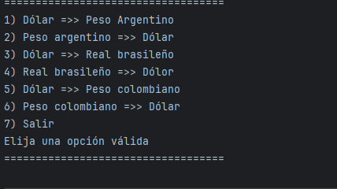
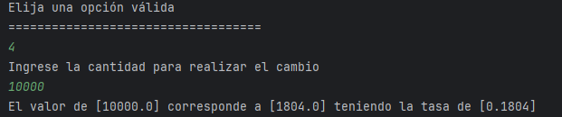

##Índice

*[Título](#Conversor-de-Monedas)

*[Descripcion_del_proyecto](#Descripción-del-proyecto)

*[Características de la aplicación y demostración](#Características-de-la-aplicación-y-demostración)

*[Tecnologias utilizadas](#Tecnologías-utilizadas)

*[Desarrollador del proyecto](#Desarrollador-del-proyecto)

*[Agradecimientos](#Agradecimientos)

*[Conclusión](#Conclusión)

<h1>Conversor de monedas</h1>

<h1>Descripción del proyecto</h1>

:construction: Proyecto finalizado :construction:

Este proyecto es un desafio propuesto en el cursos de Practicando con Java: Challenge Conversor de Monedas ofrecido por la empresa Alura Latam.

Se llevara a cabo varios tipos de conversiones,no contará con front-end, ya que 
el propósito de esté solo será el back-end.

<h1>Características de la aplicación y demostración</h1>

Al iniciar el programa lanzará la siguiente imagen:

Elegiremos algúna de las opciones marcadas con el número correspondiente.

La última imagen nos dara la información acerca de la conversión, siendo el "valor" la cantidad ingresada,
el segundo a la cantidad correspondiente a la otra divisa y por último la tasa de cambio.

Este ciclo se repetirá constantemente hasta que el usuario quiera dejar de hacer solicitudes.

<h1>Tecnologías utilizadas</h1>

Java JDK: versión 11  
Biblioteca Gson 2.10.1  
Postman   
IntelliJ IDEA

<h1>Desarrollador del proyecto</h1>

Este proyecto existe gracias a:

[ Armando Ramírez Parra](https://github.com/llBetelguese)

<h1>Agradecimientos</h1>

Se agradece a los instructores de los cursos de Alura Latam, así como a los respectivos creadores de la documentación
para cada tecnología utilizada, por su contribución.

<h1>Conclusión</h1>

Este proyecto representa un avance en el aprendizaje de backend, utilizando las tecnologías adecuadas para 
facilitar la elaboración del proyecto.

